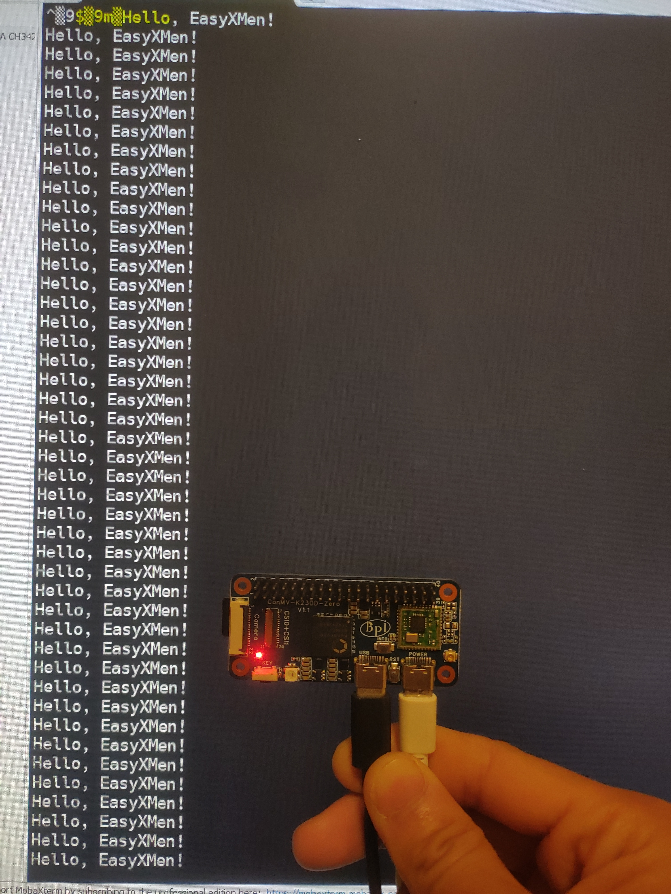
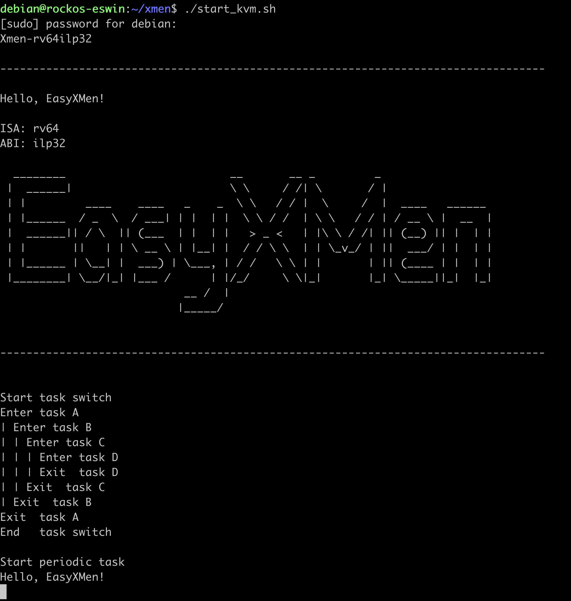

# "小满OS" RISC-V 芯片快速适配 (基于玄铁 C908 和 Sifive P550)

## 小满 OS 简介

“小满”是普华深耕车用操作系统16年的经验和成果，具备通信、诊断、网络管理、标定、存储等功能，通过了国际最高安全等级的严苛考验，是成熟的、已有丰富量产案例的产品。“小满”安全车控操作系统开源的是全部功能协议栈的源代码。同时，我们提供工具链的免费使用安装包、基于芯片的可运行示例工程，以及相关的手册文档，让我们的用户可以更加快速的上手使用。


## 针对 RISC-V 架构的 “新32位小满OS”

### 新32位工具链(编译器+模拟器+调试器)

新32位工具链是RuyiSDK的一套面向 RISC-V的开发套件，基于 RISC-V 64ilp32 ABI，融合了松弛扩展寻址技术，让64位硬件流畅运行新32位软件。我们在 qemu 上实现了硬件松弛扩展寻址模式，并用新工具链构建了业内首款新32位Linux内核。与传统32位对比，尽管新32位和传统32位都是32位Linux操作系统软件，但新32位得益于64位指令集，其性能显著优于传统32位。

基于新32位工具链里面的编译器，可以把小满OS编译成为新32位内核，后续称 “新32位小满OS”，本文后续提到的所有“小满OS”都是指这个新32位内核。

###  快速体验 "新32位小满OS" 请参考如下链接

这份文档详细说明了如何基于 RuyiSDK 里面的 qemu-system-riscv64ilp32  “新32位小满OS”

https://atomgit.com/easyxmen/XMen/blob/rv64ilp32-dev/Examples/riscv_helloworld/readme.md


## 基于C908(类似传统RTOS)适配流程(以CanMV-K230D Zero为例)

### 移植思路

- 小满OS运行在S态，目前只依赖于标准的SBI实现（本次适配用的是 k230d sdk里面 opensbi），通过新32位工具链编译得到一个二进制文件(riscv_helloworld.bin)。
- k230d sdk 的编译产物：包括 opensbi 二进制文件、Linux 镜像文件、u-boot二进制文件和设备树二进制文件(*.dtb),最后会统一打包成一份SD镜像文件。
- 开发板上电会唤 opensbi，opensbi会跳转到下一级地址
- 小满OS的入口地址与opensbi的下一级跳转地址相同，把 k230d sdk 编译产物中的 Linux Image文件，替换成小满OS二进制文件，重新打包成新的SD卡镜像文件。
- 烧录SD镜像，基于串口打印信息，判定是否适配成功。

### 工具链准备

#### 用于编译 k230d sdk的工具链
参照: https://github.com/ruyisdk/k230_linux_sdk/blob/dev/README_zh.md

下载 Xuantie-900-gcc-linux-6.6.0-glibc-x86_64-V2.10.1-20240712.tar.gz，然后解压到"/opt/toolchain/"

*提示：也可以想放到自定义的路径，下文会提到*

#### 用于编译小满 OS 的工具链
参考：https://atomgit.com/easyxmen/XMen/blob/rv64ilp32-dev/Examples/riscv_helloworld/readme.md

### 获取 k230d sdk 的工程源码

- 源码获取
```
git clone https://github.com/ruyisdk/k230_linux_sdk.git
```

- 如果工具链放到了自定义的路径，需要对 k230d_canmv_ilp32_defconfig 做对应修改

``` bash
diff --git a/buildroot-overlay/configs/k230d_canmv_ilp32_defconfig b/buildroot-overlay/configs/k230d_canmv_ilp32_defconfig
index 4c12298..504f92a 100755
--- a/buildroot-overlay/configs/k230d_canmv_ilp32_defconfig
+++ b/buildroot-overlay/configs/k230d_canmv_ilp32_defconfig
@@ -3,7 +3,7 @@ BR2_RISCV_ISA_RVC=y
 BR2_RISCV_32=y
 BR2_TOOLCHAIN_EXTERNAL=y
 BR2_TOOLCHAIN_EXTERNAL_CUSTOM=y
-BR2_TOOLCHAIN_EXTERNAL_PATH="/opt/toolchain/Xuantie-900-gcc-linux-6.6.0-glibc-x86_64-V2.10.1"
+BR2_TOOLCHAIN_EXTERNAL_PATH="/home/sunmin/bins/Xuantie-900-gcc-linux-6.6.0-glibc-x86_64-V2.10.1"
 BR2_TOOLCHAIN_EXTERNAL_CUSTOM_PREFIX="riscv64-unknown-linux-gnu"
 BR2_TOOLCHAIN_EXTERNAL_GCC_10=y
 BR2_TOOLCHAIN_EXTERNAL_HEADERS_6_6=y
```
- 编译

``` bash
make CONF=k230d_canmv_ilp32_defconfig
```

### 小满 OS 编译流程

- 修改小满OS的入口地址
```
diff --git a/Examples/riscv_helloworld/Startup/link.ld b/Examples/riscv_helloworld/Startup/link.ld
index 4d43ba9..c2370a3 100644
--- a/Examples/riscv_helloworld/Startup/link.ld
+++ b/Examples/riscv_helloworld/Startup/link.ld
@@ -3,7 +3,7 @@ ENTRY(_start)
 
 SECTIONS
 {
-       . = 0x80400000;
+       . = 0x00200000;
 
        PROVIDE(_fw_start = .);
 
```
- 编译流程
参考：https://atomgit.com/easyxmen/XMen/blob/rv64ilp32-dev/Examples/riscv_helloworld/readme.md

### 效果预览


### CI 流程（针对 CanMV K230）
为了把 小满OS一键集成到开发板SD卡镜像，可以参考如下CI流程

https://github.com/sunmin89/XMen/blob/rv64ilp32-dev/.github/workflows/build.yml

## 基于RISC-V H扩展特性的适配流程（以Sifive P550为例）

### 在X86环境交叉编译小满OS

- 开发环境及编译方法

参照 https://atomgit.com/easyxmen/XMen/blob/rv64ilp32-dev/Examples/riscv_helloworld/readme.md 

- 指定dram入口地址

```bash
diff --git a/Examples/riscv_helloworld/Startup/link.ld b/Examples/riscv_helloworld/Startup/link.ld
index 4d43ba9..6bd0ced 100644
--- a/Examples/riscv_helloworld/Startup/link.ld
+++ b/Examples/riscv_helloworld/Startup/link.ld
@@ -3,7 +3,7 @@ ENTRY(_start)

 SECTIONS
 {
-       . = 0x80400000;
+       . = 0x60000000;

        PROVIDE(_fw_start = .);
```
- 编译


### 确保p550硬件本身以及内核开启kvm

``` bash
$ sudo modprobe kvm
$ sudo dmesg | tail -n 3
[  491.361748] kvm [1074]: hypervisor extension available
[  491.361888] kvm [1074]: using Sv57x4 G-stage page table format
[  491.361972] kvm [1074]: VMID 14 bits available
$ file /dev/kvm
/dev/kvm: character special (10/232)
```

### 安装依赖(以Debian系OS为例)

```
$ cat /etc/issue
Ubuntu 24.04.1 LTS \n \l

$sudo apt update

$ sudo apt install autoconf automake autotools-dev curl libmpc-dev libmpfr-dev libgmp-dev \
                 gawk build-essential bison flex texinfo gperf libtool patchutils bc \
                 zlib1g-dev libexpat-dev git ninja-build \
                 libglib2.0-dev libfdt-dev libpixman-1-dev
```

`注意`：请确保系统libfdt-dev的版本高于v1.5.1

```bash
$ dpkg -l libfdt-dev
Desired=Unknown/Install/Remove/Purge/Hold
| Status=Not/Inst/Conf-files/Unpacked/halF-conf/Half-inst/trig-aWait/Trig-pend
|/ Err?=(none)/Reinst-required (Status,Err: uppercase=bad)
||/ Name               Version       Architecture Description
+++-==================-=============-============-==========================================================
ii  libfdt-dev:riscv64 1.7.0-2build1 riscv64      Flat Device Trees manipulation library - development files
```

### 编译ruyisdk/qemu

- 下载源码

```bash
$ git clone git@github.com:ruyisdk/qemu.git
cd qemu
$ git remote -v
origin  git@github.com:ruyisdk/qemu.git (fetch)
origin  git@github.com:ruyisdk/qemu.git (push)
ubuntu@ubuntu:~/qemu$ git log | head -1
commit e92975c3911939d8b8f6912908758a04e30322dc
```
- 打一个小补丁：指定DRAM入口地址

```bash
diff --git a/hw/riscv/virt.c b/hw/riscv/virt.c
index ab1ce22870..477c07d119 100644
--- a/hw/riscv/virt.c
+++ b/hw/riscv/virt.c
@@ -94,8 +94,8 @@ static const MemMapEntry virt_memmap[] = {
     [VIRT_IMSIC_M] =      { 0x24000000, VIRT_IMSIC_MAX_SIZE },
     [VIRT_IMSIC_S] =      { 0x28000000, VIRT_IMSIC_MAX_SIZE },
     [VIRT_PCIE_ECAM] =    { 0x30000000,    0x10000000 },
-    [VIRT_PCIE_MMIO] =    { 0x40000000,    0x40000000 },
-    [VIRT_DRAM] =         { 0x80000000,           0x0 },
+    [VIRT_PCIE_MMIO] =    { 0x40000000,    0x20000000 },
+    [VIRT_DRAM] =         { 0x60000000,           0x0 },
 };

 /* PCIe high mmio is fixed for RV32 */
```

- 配置

```bash
./configure --target-list=riscv64-softmmu
```
- 编译

```bash
make -j($nproc)
```

- 验证
```bash
$ ./build/qemu-system-riscv64 -version
QEMU emulator version 8.1.5
Copyright (c) 2003-2023 Fabrice Bellard and the QEMU Project developers
ubuntu@ubuntu:~/qemu-ruyisdk$ ./build/qemu-system-riscv64 -accel help
Accelerators supported in QEMU binary:
tcg
kvm
```

### 启动脚本

``` bash
$ cat start_kvm.sh
#!/usr/bin/env bash

sudo modprobe kvm

sudo /home/ubuntu/qemu/build/qemu-system-riscv64 \
--nographic \
--enable-kvm \
-M virt \
-cpu rv64,sv48=off \
-m 1024M \
-smp 1 \
-kernel /path/to/riscv_helloworld.bin
```
### 效果预览


### 适用于P550的RevyOS镜像链接

## 总结

小满OS能很容易地移植到支持OpenSBI 或者支持 KVM 虚拟化的硬件平台。

# 参考链接

- https://easyxmen.atomgit.com/ 小满OS简介

- https://www.aw-ol.com/news/114 【RISC-V技术动态】新32位产品级开源工具链及Linux内核

- https://ruyisdk.org/docs/intro Hello Ruyi

- https://tinylab.org/stratovirt-riscv-part1/ Stratovirt 的 RISC-V 虚拟化支持（一）：环境配置 
