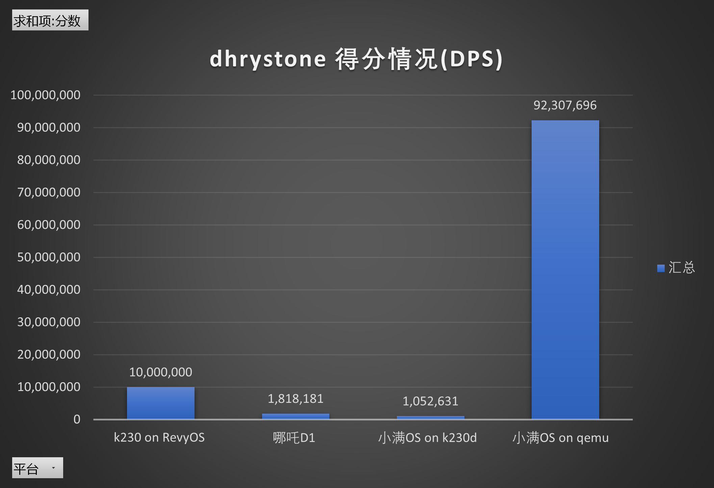

# dhrystone运行结果

### 测试方案

循环次数统一设定为：`20000000`


### 对比测试

- 单位DPS: (Dhrystones Per Second)

平台,得分
小满OS on qemu   92,307,696
                 75,000,000
哪吒D1 1,818,181
小满OS on k230d  1,052,631
k230 on RevyOS 10,000,000




### 测试结果详情

#### 小满OS on qemu

```
Dhrystone Benchmark, Version 2.1 (Language: C)

Program compiled without 'register' attribute

Execution starts, 20000000 runs through Dhrystone
        tick == :   12
        tok == :   13085
-----------------------------------------------------------------------------------
-----------------------------------------------------------------------------------
-----------------------------------------------------------------------------------
-----------------------------------------------------------------------------------
----- DHRY_ITERS = : 20000000,        Elapse = :   13 Seconds -----
-----------------------------------------------------------------------------------
-----------------------------------------------------------------------------------
-----------------------------------------------------------------------------------
-----------------------------------------------------------------------------------
Execution ends

Final values of the variables used in the benchmark:

Int_Glob:            5
        should be:   5
Bool_Glob:           0
        should be:   1
Ch_1_Glob:           A
        should be:   A
Ch_2_Glob:           B
        should be:   B
Arr_1_Glob[8]:       7
        should be:   7
Arr_2_Glob[8][7]:    20000010
        should be:   Number_Of_Runs + 10
Ptr_Glob->
  Ptr_Comp:          -2143169984
        should be:   (implementation-dependent)
  Discr:             0
        should be:   0
  Enum_Comp:         2
        should be:   2
  Int_Comp:          17
        should be:   17
  Str_Comp:          DHRYSTONE PROGRAM, SOME STRING
        should be:   DHRYSTONE PROGRAM, SOME STRING
Next_Ptr_Glob->
  Ptr_Comp:          -2143169984
        should be:   (implementation-dependent), same as above
  Discr:             0
        should be:   0
  Enum_Comp:         1
        should be:   1
  Int_Comp:          18
        should be:   18
  Str_Comp:          DHRYSTONE PROGRAM, SOME STRING
        should be:   DHRYSTONE PROGRAM, SOME STRING
Int_1_Loc:           5
        should be:   5
Int_2_Loc:           13
        should be:   13
Int_3_Loc:           7
        should be:   7
Enum_Loc:            1
        should be:   1
Str_1_Loc:           DHRYSTONE PROGRAM, 1'ST STRING
        should be:   DHRYSTONE PROGRAM, 1'ST STRING
Str_2_Loc:           DHRYSTONE PROGRAM, 2'ND STRING
        should be:   DHRYSTONE PROGRAM, 2'ND STRING

Microseconds for one run through Dhrystone: .1f 
0 
Dhrystones per Second:                      .1f 
92307696 
```

#### 小满OS on k230d 

- 跑分
```
```

#### Nezha D1

- OS
```bash
root@TinaLinux:/# uname -a
Linux TinaLinux 5.4.61 #21 PREEMPT Thu Apr 18 13:49:29 UTC 2024 riscv64 GNU/Linux

```
- 编译参数
```
ELF 64-bit LSB executable, UCB RISC-V, version 1 (SYSV), statically linked, for GNU/Linux 4.15.0, with debug_info, not stripped
```
- 跑分结果

``` bash
Dhrystone Benchmark, Version 2.1 (Language: C)

Program compiled without 'register' attribute

Please give the number of runs through the benchmark: 20000000[   35.041067] usb1-vbus: disabling


Execution starts, 20000000 runs through Dhrystone
Execution ends

Final values of the variables used in the benchmark:

Int_Glob:            5
        should be:   5
Bool_Glob:           1
        should be:   1
Ch_1_Glob:           A
        should be:   A
Ch_2_Glob:           B
        should be:   B
Arr_1_Glob[8]:       7
        should be:   7
Arr_2_Glob[8][7]:    20000010
        should be:   Number_Of_Runs + 10
Ptr_Glob->
  Ptr_Comp:          968173504
        should be:   (implementation-dependent)
  Discr:             0
        should be:   0
  Enum_Comp:         2
        should be:   2
  Int_Comp:          17
        should be:   17
  Str_Comp:          DHRYSTONE PROGRAM, SOME STRING
        should be:   DHRYSTONE PROGRAM, SOME STRING
Next_Ptr_Glob->
  Ptr_Comp:          968173504
        should be:   (implementation-dependent), same as above
  Discr:             0
        should be:   0
  Enum_Comp:         1
        should be:   1
  Int_Comp:          18
        should be:   18
  Str_Comp:          DHRYSTONE PROGRAM, SOME STRING
        should be:   DHRYSTONE PROGRAM, SOME STRING
Int_1_Loc:           5
        should be:   5
Int_2_Loc:           13
        should be:   13
Int_3_Loc:           7
        should be:   7
Enum_Loc:            1
        should be:   1
Str_1_Loc:           DHRYSTONE PROGRAM, 1'ST STRING
        should be:   DHRYSTONE PROGRAM, 1'ST STRING
Str_2_Loc:           DHRYSTONE PROGRAM, 2'ND STRING
        should be:   DHRYSTONE PROGRAM, 2'ND STRING

Microseconds for one run through Dhrystone:    0.6
Dhrystones per Second:                      1818181.9

```

#### RevyOS on k230

```bash
Dhrystone Benchmark, Version 2.1 (Language: C)

Program compiled without 'register' attribute

Execution starts, 20000000 runs through Dhrystone
Execution ends

Final values of the variables used in the benchmark:

Int_Glob:            5
        should be:   5
Bool_Glob:           1
        should be:   1
Ch_1_Glob:           A
        should be:   A
Ch_2_Glob:           B
        should be:   B
Arr_1_Glob[8]:       7
        should be:   7
Arr_2_Glob[8][7]:    20000010
        should be:   Number_Of_Runs + 10
Ptr_Glob->
  Ptr_Comp:          -547036512
        should be:   (implementation-dependent)
  Discr:             0
        should be:   0
  Enum_Comp:         2
        should be:   2
  Int_Comp:          17
        should be:   17
  Str_Comp:          DHRYSTONE PROGRAM, SOME STRING
        should be:   DHRYSTONE PROGRAM, SOME STRING
Next_Ptr_Glob->
  Ptr_Comp:          -547036512
        should be:   (implementation-dependent), same as above
  Discr:             0
        should be:   0
  Enum_Comp:         1
        should be:   1
  Int_Comp:          18
        should be:   18
  Str_Comp:          DHRYSTONE PROGRAM, SOME STRING
        should be:   DHRYSTONE PROGRAM, SOME STRING
Int_1_Loc:           5
        should be:   5
Int_2_Loc:           13
        should be:   13
Int_3_Loc:           7
        should be:   7
Enum_Loc:            1
        should be:   1
Str_1_Loc:           DHRYSTONE PROGRAM, 1'ST STRING
        should be:   DHRYSTONE PROGRAM, 1'ST STRING
Str_2_Loc:           DHRYSTONE PROGRAM, 2'ND STRING
        should be:   DHRYSTONE PROGRAM, 2'ND STRING

Microseconds for one run through Dhrystone: 0
Dhrystones per Second:                      10000000
```